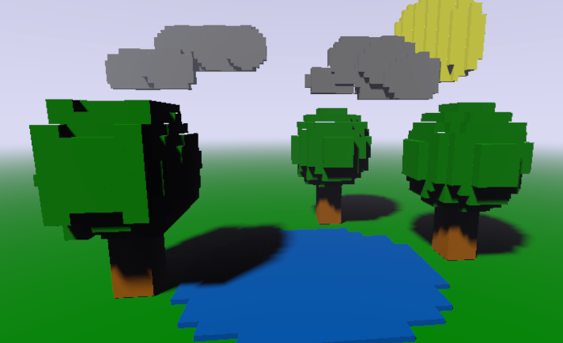

# Unity Voxelizer

The objective of this project was to develop a **Voxel Renderer** in **Unity** using either **Universal Render Pipeline (URP)** or **HD Render Pipeline (HDRP)**. This version uses URP and a compute shader to render voxels using ray marching.

## Summary

This document is organized in the following sections:
- <a href="#general-information-">General Information</a>
- <a href="#android-build-">Android Build</a>
- <a href="#known-issues-">Known Issues</a>
- <a href="#challenges-and-future-work-">Challenges and Future Work</a>
- <a href="#contributor-">Contributor</a>
- <a href="#license-">License</a>
- <a href="#third-party-">Third Party</a>
- <a href="#references-">References</a>

## General Information <a href="#summary">↑</a>

### Folder structure

This project has the following folder structure under [`Assets`](UnityTest/Assets/):
- [`Art`](UnityTest/Assets/Art) - All art assets are here. 
- [`Scenes`](UnityTest/Assets/Scenes) - With a few demo scenes:
  - `NaiveVoxelizerTest` - Demo scene for a naive voxelizer.
  - `OctreeVoxelizerTest` - Demo scene for an octree voxelizer.
  - `VoxelRendererTest` - Demo scene to test the renderer.
  - `DemoScene` - Demo scene used to take the screenshot above.
- [`Scripts`](UnityTest/Assets/Scripts) - All scripts are here.
- [`Shaders`](UnityTest/Assets/Shaders) - All shaders are here.
- [`URP`](UnityTest/Assets/URP) - URP settings assets are here (Forward renderer and Pipeline asset).

### Implementation

All the classes and interfaces in the project will be described next:

#### [IVoxelizer](UnityTest/Assets/Scripts/IVoxelizer.cs)

Interface that describes a Voxelizer, i.e., something that can generate Voxels.

#### [RandomVoxels](UnityTest/Assets/Scripts/RandomVoxels.cs)

A simple `MonoBehaviour` that generates random colored voxels within a given range. This class implements [`IVoxelizer`](UnityTest/Assets/Scripts/IVoxelizer.cs).

#### [MeshRendererVoxelizerBase](UnityTest/Assets/Scripts/MeshRendererVoxelizerBase.cs)

An abstract class (also `MonoBehaviour`) that implements [`IVoxelizer`](UnityTest/Assets/Scripts/IVoxelizer.cs)  and provides common functionalities to voxelizers that want to use a `MeshRenderer` as source. 

#### [MeshRendererNaiveVoxelizer](UnityTest/Assets/Scripts/MeshRendererNaiveVoxelizer.cs)

Class that inherits from [`MeshRendererVoxelizerBase`](UnityTest/Assets/Scripts/MeshRendererVoxelizerBase.cs) and implements a brute force way of voxelizing a `MeshRenderer`.
The algorithm consists of basically:
- Get dimensions of the mesh bounding box and adjust them to the global voxel dimensions.
- For each voxel in the bounding box, if any triangle of the mesh intersects a voxel, adds that voxel to the voxel list. 

When a voxel is created, it stores the color and uv (if any) from the first triangle that was found intersecting it.
If the `Material` of the `MeshRenderer` used by the voxelizer has a texture, the voxel uv will be used to sample that texture during the rendering.
If a voxel has no color or texture, a fallback color is used to paint it. A version of this voxelizer using `Tasks` is available.

#### [MeshRendererOctreeVoxelizer](UnityTest/Assets/Scripts/MeshRendererOctreeVoxelizer.cs)

Class that inherits from [`MeshRendererVoxelizerBase`](UnityTest/Assets/Scripts/MeshRendererVoxelizerBase.cs) and uses a `Octree` data structure to voxelize a `MeshRenderer`.
The [`Octree`](UnityTest/Assets/Scripts/Octree.cs) class will be described next.

The color of a voxel is determined in the same way as in the [`MeshRendererNaiveVoxelizer`](UnityTest/Assets/Scripts/MeshRendererNaiveVoxelizer.cs).

#### [Octree](UnityTest/Assets/Scripts/Octree.cs)

A basic `Octree` data structure implementation. The algorithm consists of:
- Get dimensions of the mesh bounding box and adjust them to the global voxel dimensions.
- For each triangle in the mesh, try to insert it in the `Octree`.
- Keeps subdividing the current region in 8 smaller subregions until the triangle reaches a region with the minimum dimension allowed (in this case the global voxel dimensions). 

In the end, every leaf of the `Octree` that is occupied (has intersection with a triangle) is a voxel.

#### [VoxelRenderer](UnityTest/Assets/Scripts/VoxelRenderer.cs)

The voxels renderer itself. The class looks for every [`IVoxelizer`](UnityTest/Assets/Scripts/IVoxelizer.cs) in the scene and joins their existing voxels in a single list.
This list is then added to a `ComputeBuffer` that is submitted to the `ComputeShader` responsible for rendering the voxels.

#### [VoxelRendererFeature](UnityTest/Assets/Scripts/VoxelRendererFeature.cs)

This class is a `ScriptableRendererFeature` and is used to call `VoxelRenderer.Render(CommandBuffer)`. This `Render` call dispatches the `ComputeShader` and then blits 
the resulting `RenderTexture` to the screen. This render pass is injected after all rendering is done. 

#### [MathHelper](UnityTest/Assets/Scripts/MathHelper.cs)

Simple class with static methods to help to check [AABB-Triangle intersections](https://fileadmin.cs.lth.se/cs/Personal/Tomas_Akenine-Moller/code/tribox_tam.pdf).

### Rendering

The voxels are rendered using a `ComputeShader` called [`VoxelRendererShader`](UnityTest/Assets/Shaders/VoxelRendererShader.compute). This shader was adapted from the [Inigo Quilez's](https://iquilezles.org/) shadertoy [raymarching example](https://www.shadertoy.com/view/Xds3zN), where much of it was removed, remaining basically box signed distance functions (SDFs). The shader algorithm can be explained as follows:
- For each pixel in the render target, a ray is traced from the camera passing through it.
  - If the ray hits a bounding box of a voxels volume, get the minimum distance (if any) among all the voxels in the volume and shade using the voxel and volume properties.

This naive implementation raymarching is quite heavy for the purpose of this project, but I will talk more about it in the <a href=#challenges-and-future-work->"Challenges and Future Work"</a> section.

## Android Build <a href="#summary">↑</a>

The project is configured to support for building for **Android** using **Vulkan** as graphics API. In case you do not want to build it, there is a build called `Voxelizer.apk` available in the folder [`Android`](UnityTest/Android). It is a very simple scene using octree voxelizers.

## Known Issues <a href="#summary">↑</a>

- **[BUG]** You can control the light direction in the scene, but the orientation in the renderer is different.
- **[BUG]** Soft shadows have some glitches.
- **[BUG]** There are some graphics glitches when voxels overlap.
- Performance in general is bad, specially in the renderer. This will be discussed in the next section <a href="#challenges-and-future-work-">"Challenges and Future Work"</a>

## Challenges and Future Work <a href="#summary">↑</a>

### Rendering
When I started to think about the project, I decided to implement a raymarching algorithm for rendering for two reasons: First, because I like playing with raymarching and, second, because I had done it before.
However, this choice was a bad take. A naive raymarching algorithm is pretty bad for rendering thousands of entities (in our case voxels) without any spatial partitioning technique to support fast querying of voxels. I thought about ways of improving the renderer, but it was too late to implement them. Some of those ideas were:
- Like I said, implementing a spatial partitioning technique for fast querying of voxels in the compute shader (e.g kD-Tree?, Bounding Volume Hierarchy?).
- Implementing a tile-based approach, such as those seen in a tile-based GPUs. I would add another kernel to the compute shader that would divide the render target into tiles, and then add each voxel to its corresponding tile. In the main kernel, only voxels belonging to a given tile would be evaluated at time.

In the end, If I still had time I would actually implement another renderer based on the default URP renderer and use `DrawMeshInstancedIndirect` to draw all the voxels with GPU instancing.

### Voxelization

About the voxelization. The algorithms were not hard to implement; however, those basic implementations are really slow. For the naive approach, I manage to improve it a bit by using async `Tasks`, which was challenging, but in the end worked well. 
The naive algorithm is `O(x*y*z*t)` where `x`, `y`, `z` are the mesh bounds dimensions in voxels and `t` is the number of triangles in the mesh. That's clearly bad. I thought later that I could have done a search by triangle instead and check only voxels in the triangle bounds.

When I was writing this document, I realized I had implemented the `Octree` in a wrong and very inneficient way. I was checking every triangle at every region instead of inserting triangles at root and having the real benefit of the `Octree`. I managed to fix in time though. The algorithm time complexity is `O(t*log(n))` where `t` is the number of triangles and `n` is the number of nodes. I did not have time to think about a `Octree` async version.

The whole processing on the CPU side could be improved if I had used **ECS** and **Jobs System**, but I did not take that path because I do not have experience with them and there was not enough time to research for this project. 

### Future Work

As a summary of features that I would like to do in the future, I could say:
- Add spatial partitioning technique in compute shader.
- Add tile-based approach for voxel querying.
- Implement another renderer using `DrawMeshInstancedIndirect`.
- Create a custom SRP, stripping out URP features that are not useful for the voxel renderer.
- Implement voxelizers using ECS and Jobs System.
- (Actually research how people actually implement voxel renderers :D) 

## Contributor <a href="#summary">↑</a>

  - Teofilo Dutra - [teodutra](https://teodutra.com)

## License <a href="#summary">↑</a>

This project is licensed under the [MIT License](/LICENSE.md).

## Third Party <a href="#summary">↑</a>

This project uses the following asset:

  - [Space Robot Kyle](https://assetstore.unity.com/packages/3d/characters/robots/space-robot-kyle-4696) - [Standard Unity Asset Store EULA](https://unity3d.com/legal/as_terms)
  
## References <a href="#summary">↑</a>

- [AABB-Triangle intersections paper](https://fileadmin.cs.lth.se/cs/Personal/Tomas_Akenine-Moller/code/tribox_tam.pdf)
- [Inigo Quilez's website](https://iquilezles.org/) 
- [Shadertoy raymarching example](https://www.shadertoy.com/view/Xds3zN)